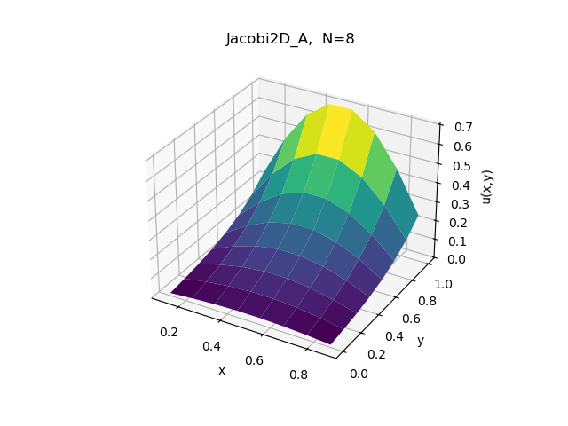

The discretization of the Laplace equation

$$
\Delta u = \frac{\partial u}{\\partial x} + \frac{\partial u}{\partial y} = 0
$$

with a five point stencil is given by:

$$
u_{i-1,j}^{(n+1)} -2u_{i,j}^{(n+1)} +u_{i+1,j}^{(n+1)} + u_{i,j-1}^{(n+1)} -2u_{i,j}^{(n+1)} + u_{i,j+1}^{(n+1)} = 0
$$

This equation is also used to check the solution and calculate the residual.
When we rearrange the equation above, we obtain the update rule for a point:

$$
u_{i,j}^{(n+1)} =\frac{u_{i-1,j}^{(n)} + u_{i,j-1}^{(n)} +u_{i+1,j}^{(n)} + u_{i,j+1}^{(n)}}{4}
$$

This equation can be interpreted as calculating the mean value of the neighbours at that point .

The provided code implements solveJacobi2D_A using Coordinate (COO) format for the sparse matrix. The task is to implement solveJacobi2D_C as a matrix-free version, optimizing for time-to-solution and memory usage. A third variant, solveJacobi2D_B (using Compressed Sparse Row or CSR format), is also present in the code.

All solvers were implemented, compiled with g++ using -std=c++14 -O3, and tested on a grid with $  N_x = N_y = 9  $ (internal points $  N=64  $), tolerance $  TOL=1e-6  $, and max iterations 10000. Solutions from solveJacobi2D_A (Sol_ref.log) and solveJacobi2D_C (Sol.log) match exactly, confirming correctness. Timings and memory were measured using system tools like time and Valgrind.

Implementation Details

solveJacobi2D_A uses COO format storage (row, col, value) and traverses through non-zeros, which, although generic, has a large overhead due to traversal through a large number of elements.

solveJacobi2D_C is matrix-free because solveJacobi2D_C computes the contributions of the stencils directly and does not store the matrix. Constants of the matrix such as $   a_{11} = -(2/\Delta x^2 + 2/\Delta y^2)   $ and the coefficients of the other nodes in the stencils are computed in advance. In the main loop, the program goes through the grid points (for i=1 to $   N_x   $-1, j=1 to $   N_y   $-1), and the boundaries are treated with conditional statements to access the nodes in the stencils. Results are saved in an auxiliary vector and copied back for the Jacobi iteration. The computation of the residual in computeResidualMatrixFree is also matrix-free since it computes $   RHS-A \cdot sol $

Nothing new in dynamic allocation has been introduced in functions.cpp, as per requirements. Local functions such as ‘ij2l map’ translate coordinates (i, j) into linear indices.

The solutions of the two functions `Jacobi2D_A` and `Jacobi2D_C` match up very closely.

